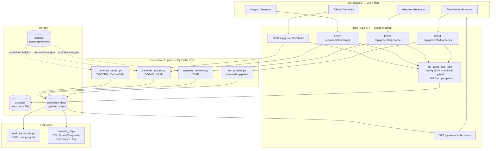

<div align="center">

# Synthetic Medical Data Generation Suite

**A full-stack generative-AI platform that produces privacy-safe synthetic medical data across four modalities — imaging, clinical tabular, genomic, and time-series — with a React console, a Flask API, and quantitative fidelity evaluation for every output.**

[](https://www.python.org/)
[](https://pytorch.org/)
[](https://flask.palletsprojects.com/)
[](https://react.dev/)
[](https://sdv.dev/)
[](#-the-problem)

[Features](#-features) · [Architecture](#-architecture) · [User Interface](#-user-interface) · [Installation](#-installation) · [Results](#-results)

</div>

---

## Table of Contents

- [The Problem](#-the-problem)
- [The Solution](#-the-solution)
- [Features](#-features)
- [Models & Why They Were Chosen](#-models--why-they-were-chosen)
- [Design Principles](#-design-principles)
- [Architecture](#-architecture)
- [User Interface](#-user-interface)
- [API Reference](#-api-reference)
- [Installation](#-installation)
- [Running the Project](#-running-the-project)
- [Datasets](#-datasets)
- [Evaluation Methodology](#-evaluation-methodology)
- [Results](#-results)
- [Project Structure](#-project-structure)
- [Technologies](#-technologies)
- [Roadmap](#-roadmap)
- [Contact](#-contact)

---

## The Problem

Medical AI is bottlenecked by **data scarcity and privacy restriction**. Hospitals cannot share patient records across institutions under HIPAA/GDPR, most public medical datasets are far too small to train robust models, and the datasets that do exist are frequently class-imbalanced in exactly the ways that matter clinically.

The result is a deadlock: the models that would most benefit from more data are the ones legally least able to get it.

## The Solution

A generation platform that learns the *statistical structure* of real medical data and then produces unlimited synthetic records that preserve that structure while containing **zero real patient information** — delivered not as a pile of research scripts, but as a service with an API and a UI that a non-ML researcher can actually operate.

```
Real dataset → Preprocessing → Train generator → Sample synthetic data → Fidelity evaluation → Export
```

## Features

**Four Generation Modalities**

| Modality | What's Generated | Models |
|---|---|---|
| **Medical Imaging** | Brain MRI, Chest X-ray, skin-lesion images | DCGAN, cGAN |
| **Clinical Tabular** | Patient records — diabetes, heart disease, stroke, sepsis | TabDDPM, CopulaGAN |
| **Genomic** | Gene-expression profiles (breast cancer) | TVAE |
| **Time-Series** | Sequential clinical measurement data | Pipeline-driven generation |

**Service Layer**
- **Flask REST API** wrapping all four pipelines behind one service, with CORS enabled for browser clients
- **Request-scoped job isolation** — every generation request gets a UUID-namespaced output file, so concurrent requests never collide
- **Bring-your-own-data** — each endpoint accepts an optional uploaded source file via multipart form, falling back to bundled pretrained models when none is supplied
- Generated artifacts served back over a dedicated download route

**Generation Console (React)**
- Four-tab Material UI workspace — one tab per modality, each with its own configuration form
- File upload, live generation status, and direct download of results
- Built on React 19 + TypeScript + Vite

**Evaluation**
- **SSIM** for image fidelity, **SDV Quality & Diagnostic Reports** for tabular/genomic distribution fidelity
- Feature-correlation matrix comparison (real vs. synthetic)
- Downstream utility testing — train a model on synthetic data, measure against one trained on real

## Models & Why They Were Chosen

**DCGAN** — Medical imaging. Convolutional generator/discriminator learn spatial structure (tissue texture, lesion morphology) that a dense network cannot. Batch normalization stabilizes an otherwise fragile adversarial training loop.

**Conditional GAN (cGAN)** — Imaging with control. Conditions generation on class label, so you can request *"pneumonia X-ray"* rather than *"an X-ray"* — essential when the whole point is correcting class imbalance.

**TabDDPM** — Clinical tabular data. A diffusion model that learns to reverse a noising process. Empirically better at matching marginal distributions on structured data than GAN-family alternatives, which tend to mode-collapse on mixed categorical/continuous columns.

**CopulaGAN** — Clinical tabular data with dependency structure. Models inter-feature correlation explicitly via copula functions — the right choice when age, BMI, and blood pressure are *not* independent and a generator that treats them as such produces clinically nonsensical records.

**TVAE** — Genomic profiles. Encodes very high-dimensional gene expression into a compact latent space and decodes new samples from it. Handles the dimensionality regime where GANs become unstable.

## Design Principles

1. **Zero real patient data in any output.** Generators learn distributions; they do not memorize and replay records.
2. **Fidelity must be measured, not asserted.** Every modality has a quantitative evaluation path (SSIM / SDV reports), not just visual inspection.
3. **Usable by non-ML researchers.** The people who need synthetic medical data are frequently clinicians and domain researchers, not PyTorch users — hence the API and UI rather than notebooks.
4. **Job isolation by default.** Concurrent requests write to UUID-scoped paths; no shared mutable output directory.

## Architecture


<details>
<summary><b>Detailed system view (Mermaid)</b></summary>



</details>

**Request lifecycle:** the UI posts a config JSON plus an optional source file → `get_config_and_file()` parses the config and persists any upload under a UUID-prefixed name → the matching generation script runs as a subprocess against that config → output lands in `generated_data/` under its own UUID filename → the UI receives the path and offers it for download. No two requests can overwrite each other's artifacts.

## User Interface

The React console exposes all four generators as tabs in a single workspace — pick a modality, configure it, optionally upload your own source data, generate, download.

| Generation console | Generated samples |
|---|---|
|  |  |

| Output preview | Evaluation report |
|---|---|
|  |  |

**Interface layout**

```
┌─────────────────────────────────────────────────────────────┐
│  Synthetic Medical Data Generator                           │
├─────────────────────────────────────────────────────────────┤
│  [ Tabular Data ] [ Medical Imaging ] [ Genomic ] [ Series ] │
├─────────────────────────────────────────────────────────────┤
│                                                             │
│   Model:        [ TabDDPM  ▾ ]                              │
│   Rows:         [ 1000     ]                                │
│   Source file:  [ Choose file… ]  (optional)                │
│                                                             │
│              [  Generate Synthetic Data  ]                  │
│                                                             │
│   ──────────────────────────────────────────────────────    │
│   Status: complete · tabular_output_a4f2c1.csv  [Download]   │
└─────────────────────────────────────────────────────────────┘
```

## API Reference

All generation endpoints accept `multipart/form-data` with a `config` field (JSON string) and an optional `sourceFile`.

| Method | Endpoint | Purpose |
|---|---|---|
| `GET` | `/` | Health check |
| `POST` | `/api/generate/tabular` | Generate clinical tabular records (TabDDPM / CopulaGAN) |
| `POST` | `/api/generate/imaging` | Generate medical images (DCGAN / cGAN) |
| `POST` | `/api/generate/genomic` | Generate gene-expression profiles (TVAE) |
| `POST` | `/api/generate/timeseries` | Generate sequential clinical data |
| `GET` | `/generated/<filename>` | Download a generated artifact |

**Example**

```bash
curl -X POST http://localhost:5000/api/generate/tabular \
  -F 'config={"model":"tabddpm","num_rows":1000}' \
  -F 'sourceFile=@my_clinical_data.csv'
```

```json
{
  "status": "success",
  "message": "Data generated.",
  "fileUrl": "/generated/tabular_output_a4f2c1e9.csv"
}
```

Errors return `{"status": "error", "message": "..."}` with a `500`, including the
subprocess `stderr` when a generation script itself fails.

## Installation

**Requirements:** Python 3.10+ · Node.js ≥ 18

```bash
git clone https://github.com/Stevemeg/Synthetic-Data.git
cd Synthetic-Data

# Backend
python -m venv venv
# Windows: .\venv\Scripts\Activate.ps1  |  Linux/macOS: source venv/bin/activate
pip install -r requirements.txt

# Frontend
cd frontend && npm install && cd ..
```

## Running the Project

```bash
# Terminal 1 — Flask API (http://localhost:5000)
cd backend
python app.py

# Terminal 2 — React console (http://localhost:5173)
cd frontend
npm run dev
```

**CLI-only usage** (no UI, direct generation):

```bash
cd backend
python train_tabular_model.py        # train a tabular generator
python generate_tabular.py           # sample from it
python generate_images.py            # DCGAN / cGAN imaging
python generate_genomic.py           # TVAE genomic profiles
python run_pipeline.py               # end-to-end pipeline

python evaluate_visuals.py           # SSIM + visual sample grids
python evaluate_ml.py                # SDV reports + downstream utility
```

## Datasets

**Imaging** — Brain MRI Dataset · Chest X-ray Pneumonia (Kaggle) · Skin Cancer HAM10000

**Clinical Tabular** — Diabetes 130-US Hospitals · Heart Disease UCI · Stroke Prediction · Sepsis Survival

**Genomic** — TCGA-BRCA Gene Expression · Microarray Gene Expression (GSE45827)

**9 source datasets total.** Every model is trained on public, de-identified research data; no private patient records are used at any stage.

## Evaluation Methodology

Different modalities demand different fidelity measures — a single metric across all of them would be meaningless.

**Images (DCGAN / cGAN)**
- **SSIM** — perceptual structural similarity against real samples
- Visual inspection of generated grids
- Class-distribution matching (are conditional labels actually balanced?)

**Tabular & Genomic (TabDDPM / CopulaGAN / TVAE)**
- **SDV Quality Report** — column-shape and column-pair-trend scoring
- **SDV Diagnostic Report** — structural validity checks (ranges, categories, missing-value patterns)
- Per-feature distribution comparison (mean, std, skew)
- **Feature-correlation matrix comparison** — the check that catches generators producing statistically plausible but clinically impossible records

**All modalities**
- **Downstream utility** — train a classifier on synthetic data, evaluate on real held-out data, compare against a classifier trained on real. This is the test that actually matters: does the synthetic data *work* as a training substitute?

## Results

| Outcome | Result |
|---|---|
| Source datasets covered | **9**, across 3 data families |
| Generation modalities served | **4** (imaging, tabular, genomic, time-series) |
| Image fidelity | Generated samples visually consistent with real distributions, validated via **SSIM** |
| Tabular fidelity | Real-vs-synthetic distributions matched across features per **SDV Quality Report** |
| Genomic fidelity | Gene-gene correlation structure preserved in generated profiles |
| **Downstream utility** | Models trained on synthetic data performed **comparably** to models trained on real data |
| Real patient records in output | **Zero** |


## Project Structure

```
Synthetic-Data/
│
├── backend/
│   ├── app.py                     # Flask REST API — 4 generation endpoints + download route
│   ├── run_pipeline.py            # End-to-end pipeline (also serves time-series endpoint)
│   ├── train_tabular_model.py     # Tabular generator training (TabDDPM / CopulaGAN)
│   ├── generate_tabular.py        # Clinical tabular sampling
│   ├── generate_images.py         # DCGAN / cGAN image sampling
│   ├── generate_genomic.py        # TVAE genomic sampling
│   ├── evaluate_visuals.py        # SSIM + visual sample grids
│   ├── evaluate_ml.py             # SDV Quality/Diagnostic + downstream utility
│   ├── uploads/                   # User-supplied source files (UUID-scoped)
│   ├── models/                    # Trained generator checkpoints
│   └── generated_data/            # Synthetic output artifacts (UUID-scoped)
│
├── frontend/                      # React 19 + TypeScript + Vite + MUI
│   ├── src/
│   │   ├── App.tsx                # Tabbed workspace shell + theme
│   │   └── components/
│   │       ├── TabularGenerator.tsx
│   │       ├── ImageGenerator.tsx
│   │       ├── GenomicGenerator.tsx
│   │       └── TimeSeriesGenerator.tsx
│   ├── package.json
│   └── vite.config.ts
│
├── assests/
│   ├── architecture/              # Architecture diagrams
│   ├── samples/                   # Generated-sample screenshots
│   └── evaluation/                # Evaluation report screenshots
│
└── requirements.txt
```

## Technologies

**Generation** — PyTorch · SDV (TabDDPM, CopulaGAN, TVAE) · ydata-synthetic · torchvision
**Data & Evaluation** — NumPy · Pandas · scikit-learn · SciPy · OpenCV · Matplotlib · Seaborn
**Service** — Flask · flask-cors
**Frontend** — React 19 · TypeScript · Vite · Material UI 7 · Axios

## Roadmap

| Status | Milestone |
|---|---|
| ✅ | Four-modality generation (imaging · tabular · genomic · time-series) · Flask REST API · React/MUI console · UUID job isolation · user file upload · SSIM + SDV evaluation · downstream utility validation |
| ☐ | Formal differential-privacy guarantees with reported ε budgets |
| ☐ | Containerized deployment (Docker Compose for API + UI) |
| ☐ | Async job queue with progress streaming for long generation runs |
| ☐ | Automated evaluation report generation per job, returned with the artifact |
| ☐ | Cloud deployment (AWS / GCP) with authenticated multi-user access |

## Why This Matters

Synthetic data is one of the few mechanisms that lets healthcare institutions collaborate on AI without moving patient records across legal boundaries. This project treats that as an engineering problem rather than a research demo: multiple modalities behind one service, fidelity measured rather than claimed, and an interface a domain researcher can use without writing PyTorch.

## Contact

**Kona Bharath Vamshidhar Reddy**
B.E. Artificial Intelligence & Machine Learning · Acharya Institute of Technology
[konabharath2004@gmail.com](mailto:konabharath2004@gmail.com) · [LinkedIn](https://www.linkedin.com/in/kona-bharath-vamshidhar-reddy/) · [GitHub](https://github.com/Stevemeg)

---

<div align="center"><sub>Privacy-safe by construction — the data is real enough to train on, and real to no one.</sub></div>
