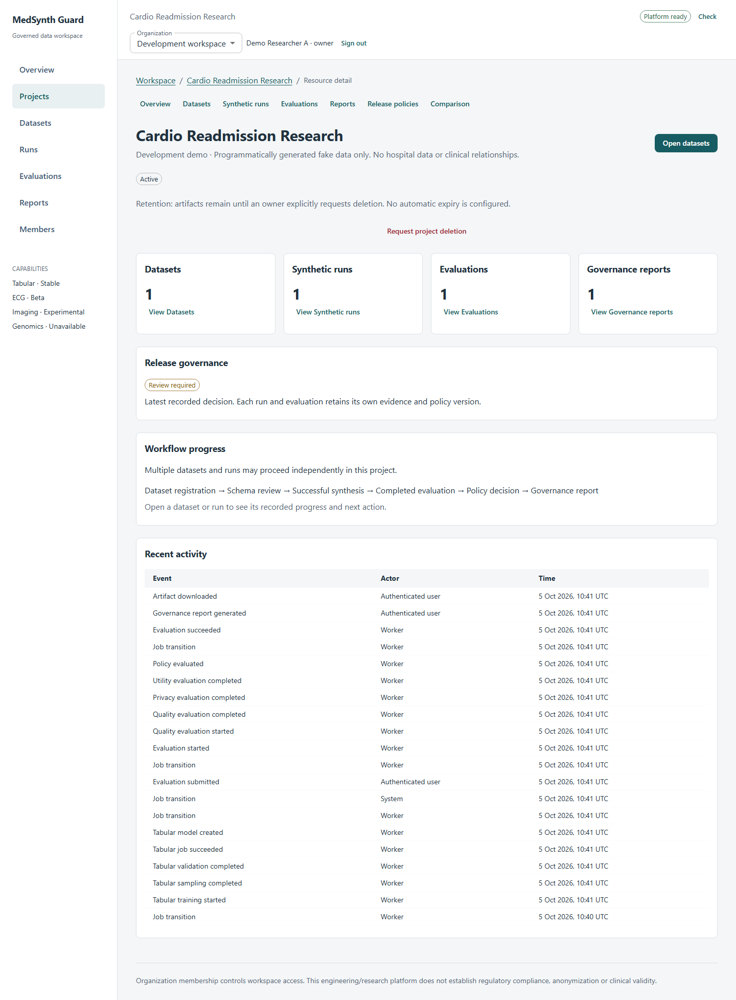
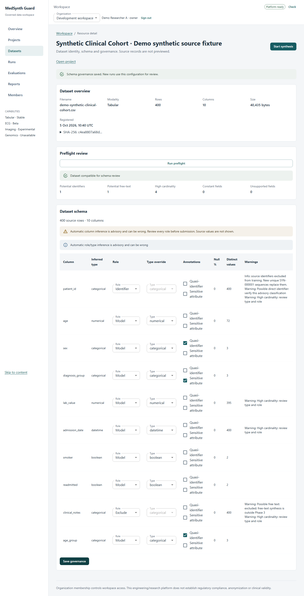
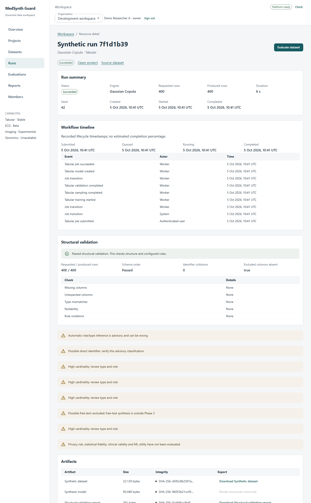
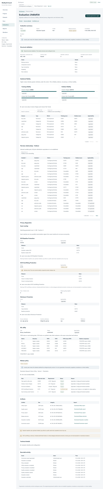
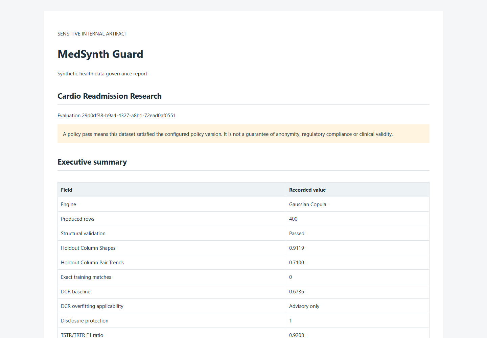

# MedSynth Guard

**Synthetic Health Data Governance & Validation Platform — Phase 6 engineering work**

## Product overview

MedSynth Guard lets teams register structured clinical datasets, configure how columns should be treated, train real synthetic-data models, generate reproducible synthetic datasets, validate structural correctness, and preserve model/data provenance. A separate supervised worker executes jobs with PostgreSQL persistence. Tabular evaluation measures statistical fidelity, selected privacy/disclosure diagnostics and declared ML tasks independently. Versioned project policies turn that evidence into auditable PASS/FAIL/REVIEW_REQUIRED decisions; these do not establish anonymity, compliance or clinical validity.

The governed workspace connects projects, dataset governance, reviewed generation, contextual evaluation, explainable release decisions and portable HTML governance reports. Important resources have refreshable URLs. Independent evidence replaces a composite score or model ranking.

```text
Project → Source Dataset → Preflight & Schema Governance → Synthetic Run
  → Evaluation → Privacy / Fidelity / Utility Evidence → Release Policy Decision
  → Governance Report → Controlled Artifact Export
```

## Workspace screenshots

These views contain only the programmatically generated demo source fixture.







See [UX](docs/UX.md), [reporting](docs/REPORTING.md) and [the six-minute demo](docs/DEMO.md). Current screenshots were refreshed against the authenticated generated-data demo. Verification details are recorded in [Phase 6 verification](docs/PHASE_6_VERIFICATION.md).

## Real-world problem

Healthcare teams need reproducible development datasets and accountable workflows. Calling an output synthetic does not establish whether a model memorized records, preserved useful structure, or supports a downstream task. Persistent lineage enables later evaluation; it does not replace evaluation.

## Current maturity

| Capability | Maturity | Current behavior |
| --- | --- | --- |
| Registration/input contracts | Stable contracts | Bounded CSV ingestion, structure and hashes |
| Clinical tabular synthesis | Stable | Real Gaussian Copula default; CTGAN and TVAE opt-in Beta |
| Tabular evaluation | Beta | Real SDMetrics fidelity/DCR/disclosure, sklearn TRTR/TSTR, explicit release policies |
| ECG/time series | Beta | Per-job VAE training and normalized unlabeled windows |
| Medical imaging | Experimental | Opt-in unconditional DCGAN, individual PNGs in ZIP |
| Genomics | Unavailable / research roadmap | No legitimate model or genomic ingestion/export |

No source-row resampling or random genomic placeholder is exposed. Imaging is disabled by default and always blocked in APP_ENV=production.

## Clinical tabular workflow

Register CSV -> preflight -> review/override column roles/types -> choose
Gaussian Copula/CTGAN/TVAE -> queue -> verified source -> seeded train/holdout
split -> fit training partition -> generate requested rows -> new synthetic IDs ->
structural validation -> restricted model + generated CSV + report + manifest.
Free text is excluded; no source-row bootstrap or hidden fallback exists.
See [synthesis](docs/TABULAR_SYNTHESIS.md), [metadata](docs/TABULAR_METADATA.md),
[validation](docs/TABULAR_VALIDATION.md), and [verification](docs/PHASE_3_VERIFICATION.md).

## Supported workflows

Create project -> register dataset -> submit job -> worker generates -> inspect durable status -> retrieve artifacts and manifest.

ECG CSV is headerless UTF-8: each row contains 96-10000 finite numeric signal samples followed by a source-label field. Labels are ignored. The configured sampling rate must match the source. NeuroKit detects peaks and extracts 96-sample windows, normalized per window to [0,1]. The VAE produces exactly the requested count. dataset.npz includes synthetic_sequences of shape (count,96), sampling rate and normalization, without diagnostic labels. A complete checkpoint is retained as a restricted artifact without HTTP download.

Imaging selects MRI, X-Ray or Skin checkpoints for 64x64 RGB PNGs. There is no uploaded-image conditioning, DICOM support, or clinical realism claim. Original model files remain at their original paths. Legacy TVAE pickles and the Keras decoder are not API engines; tabular models fit the registered source. Useful offline Python tools remain.

## Architecture

React/TypeScript/Material UI -> FastAPI OIDC/session and organization authorization -> PostgreSQL + private S3-compatible storage. A separate worker claims PostgreSQL-backed jobs, computes in a supervised child, and publishes registered, SHA-256 verified artifacts. PostgreSQL stores identities, memberships, metadata and append-only application audit events. Local filesystem storage remains available for tests and lightweight development.

See [architecture](docs/ARCHITECTURE.md), [API](docs/API.md), [jobs](docs/JOB_LIFECYCLE.md), [artifacts](docs/ARTIFACT_MODEL.md), and [ADRs](docs/adr/ADR-0001-fastapi.md).

## Privacy disclaimer

Synthetic data is not automatically anonymous. Memorization, overfitting and linkage may disclose source information. No HIPAA/GDPR compliance, differential privacy, zero re-identification risk or permission to share is claimed. Protect source/output data, learned weights, metadata, backups and storage. See [privacy model](docs/PRIVACY_MODEL.md).

**MedSynth Guard is an engineering/research platform. It does not by itself establish HIPAA/GDPR compliance, clinical validity, anonymization or zero re-identification risk.** OIDC authentication, organization membership and backend role enforcement are implemented. Deployment still requires HTTPS, a maintained identity/storage provider, reviewed configuration, operational controls and an appropriate data-use assessment. See [security](docs/SECURITY.md) and [Phase 6 verification](docs/PHASE_6_VERIFICATION.md); release status is determined by actual verification, not infrastructure features.

## Evaluation philosophy

Structural validity, fidelity, privacy risk, clinical validity and downstream utility are separate dimensions. Current tests verify software contracts, dimensions/counts, persistence, queue ownership and artifact integrity. Passing software tests does not establish release safety for a particular source dataset. Actual tabular evaluation reports provide separate, bounded statistical evidence. Evaluation reconstructs the original holdout, requires an explicit attacker model and ML target when applicable, and reports methodology limits. There is no weighted overall score or automatic model winner. See [evaluation](docs/EVALUATION.md), [fidelity](docs/STATISTICAL_FIDELITY.md), [privacy diagnostics](docs/PRIVACY_EVALUATION.md), [utility](docs/ML_UTILITY.md), [policies](docs/RELEASE_POLICIES.md) and [Phase 4 verification](docs/PHASE_4_VERIFICATION.md).

## Local setup

Verified on Windows, Python 3.11, Node 24, Docker Desktop and PostgreSQL 16. From repository root:

```powershell
python -m venv .venv
.venv/Scripts/python.exe -m pip install -r backend/requirements-dev.txt
.venv/Scripts/python.exe -m pip install -r backend/requirements-ml.txt
.venv/Scripts/python.exe -m pip install -r backend/requirements-evaluation.txt
Copy-Item .env.example .env
```

Set a newly generated POSTGRES_PASSWORD in ignored .env before starting Compose. No password is committed. Generate one using `python -c "import secrets; print(secrets.token_urlsafe(32))"`. Preserve an existing .env rather than overwriting it. Linux/macOS use .venv/bin/python and cp. GitHub-hosted Linux CI verifies the backend, security and authenticated container workflows; macOS was not tested.

```powershell
docker compose up -d postgres
.venv/Scripts/python.exe -m alembic upgrade head
```

PostgreSQL binds to 127.0.0.1:55432 with a persistent development volume. Retain both that volume and ARTIFACT_STORAGE_PATH bytes. DATABASE_URL overrides a URL derived from POSTGRES_* variables; explicit URLs must use postgresql+psycopg.

## Running backend

In separate terminals:

```powershell
.venv/Scripts/python.exe -m backend.app
.venv/Scripts/python.exe -m backend.worker
```

FastAPI defaults to 127.0.0.1:5000, debug/reload disabled. Open /docs or /openapi.json. /health checks process liveness; /ready checks migrated PostgreSQL and writable storage, returning 503 on failure. Migrations never run automatically on API startup.

Defaults: 10 MB total request including multipart overhead, 1000 ECG outputs, 64 images, 1000 source rows, 5000 extracted windows, 10 ECG epochs, 125 Hz, explicit localhost CORS, three attempts, 60-second lease and 10-second heartbeat. CLI entry points load .env; existing environment variables take precedence.

A job POST returns 202 without running ML. Poll status and retrieve artifacts after success. A project-scoped Idempotency-Key replay returns the same job with 200; a different payload with that key returns 409.

**Breaking HTTP changes:** Flask and /api/generate/*, /api/health, /api/capabilities and /generated/* are removed. Use /api/v1 dataset/job/artifact resources. Direct generation Python APIs and offline CLIs remain. See [development](docs/DEVELOPMENT.md).

## Running frontend

```powershell
cd frontend
npm ci
Copy-Item .env.example .env
npm run dev -- --host 127.0.0.1
```

Open http://127.0.0.1:5173. VITE_API_URL defaults to http://127.0.0.1:5000. Overview provides platform status, projects and recent activity. Project-scoped inventories connect schema governance, generation and evaluation. Successful tabular runs offer Evaluate dataset; completed evaluations offer Generate governance report. Download registered artifacts from the resource or Reports inventory. Restricted learned models have no download action.

## Generated fake-data demo

With the documented local API and worker running, use:

```powershell
.venv/Scripts/python.exe -m backend.scripts.create_demo_project
```

This creates an isolated Cardio Readmission Research project with a **Demo synthetic source fixture**, Gaussian Copula run, Full evaluation, Illustrative Research Demo Policy and verified HTML report. Repeated invocation creates another clearly marked project without overwriting work. No clinical relationships or hospital provenance are claimed. See [DEMO.md](docs/DEMO.md) for startup and the 5–8 minute walkthrough.

## Running tests

Start PostgreSQL before integration/model tests:

```powershell
.venv/Scripts/python.exe -m pytest -q
.venv/Scripts/python.exe -m pytest -q -m integration
.venv/Scripts/python.exe -m pytest -q -m model
.venv/Scripts/python.exe -m compileall -q backend
.venv/Scripts/python.exe -m ruff check backend
.venv/Scripts/python.exe -m ruff format --check backend
.venv/Scripts/python.exe -m pip check
.venv/Scripts/python.exe -m backend.scripts.platform_smoke_test --start-services
.venv/Scripts/python.exe -m backend.scripts.tabular_smoke_test --start-services
.venv/Scripts/python.exe -m backend.scripts.evaluation_smoke_test --start-services
.venv/Scripts/python.exe -m backend.scripts.product_smoke_test --start-services
cd frontend
npm ci
npm test
npm run typecheck
npm run lint
npm run build
npm audit --audit-level=low
npm exec -- playwright install chromium
npm run test:e2e
npm run test:visual
# Local API + worker + demo bootstrap required:
npm run test:live
```

Default tests exclude integration/model markers. PostgreSQL tests migrate disposable UUID-named schemas; no SQLite substitute is used. TEST_DATABASE_URL optionally selects a dedicated DB; otherwise the configured DB is used with separate schemas. The role needs schema/function privileges. Model tests use tiny one-epoch ECG training and preserved imaging inference.

The smoke script starts separate real API/worker processes, verifies API restart, and retains a clearly identified invented-ECG project and artifacts for inspection. It uses one ECG epoch. Without --start-services it targets existing API/worker processes. See [verification](docs/PHASE_2_VERIFICATION.md).

## Project structure

```text
backend/
  app/
    main.py             # FastAPI lifecycle
    api/routes/         # typed HTTP boundaries
    core/               # logging, runtime, security, config compatibility
    db/                 # SQLAlchemy models, sessions, explicit repositories
    schemas/            # platform and preserved generation contracts
    services/           # projects, datasets, jobs, artifacts, generation
    workers/            # supervised generation execution
    storage/            # protocol and local implementation
    utils/              # bounded input handling
  alembic/              # migrations, constraints and triggers
  scripts/              # offline tools, live smoke, reconciliation
  tests/
  worker.py
  requirements*.txt
frontend/
docs/                   # engineering docs, ADRs and verification
compose.yaml            # PostgreSQL only
alembic.ini
.env.example
```

backend/requirements.txt is the base runtime; root requirements forwards there. Additive groups cover ML, dev and preserved offline labs. Direct Python dependencies are pinned; transitive dependencies are not fully locked. Frontend uses package-lock.json.

## Current limitations

- OIDC and organization roles are implemented; no application encryption service, secure physical erasure or scheduled expiry. Object-store encryption and backup lifecycle require infrastructure configuration.
- Private S3-compatible storage is implemented; local filesystem storage remains for tests/lightweight development. The local MinIO fixture is not a maintained production storage recommendation.
- ECG outputs are normalized unlabeled windows, without calibrated voltages, full recordings, clinical evidence or privacy scores.
- Original imaging training provenance/licensing remains incomplete.
- Only queued jobs can be cancelled through HTTP.
- Recovery needs PostgreSQL, shared storage and reasonably synchronized clocks. Filesystem/database publication is not a distributed transaction; crash orphans require maintenance.
- Checkpoint downloads remain restricted; all other artifact downloads require authenticated organization membership in OIDC mode. Evaluation reports contain sensitive source-derived statistics and must remain internal.
- Single-table evaluation only; no free-text or multi-table synthesis, differential privacy or universal release thresholds.
- DCR random-baseline seed cannot be controlled through the supported upstream public API. Original row-split patient leakage is reported, not retrospectively repaired.
- Reproducibility is tested in the current CPU/runtime, not guaranteed across platforms.
- Abrupt failures may leave ignored generation workspaces.

## Roadmap

Phases 1–4 provide the established platform, synthesis and evaluation methodology. Phase 5 adds the professional governed workspace, reports, fake-data demo and browser verification. Phase 6 adds OIDC, organization authorization, private S3-compatible storage and release operations. Its actual outstanding verification is recorded separately. See baseline and current release-gate status in [Phase 6 verification](docs/PHASE_6_VERIFICATION.md).

## Identity, organizations and operations

OIDC Authorization Code with PKCE uses revocable server-side sessions. Tokens
are not kept in browser localStorage. Projects belong to an Organization;
OWNER, EDITOR and VIEWER membership governs API access. UUID knowledge grants
no access. Members are assigned to identities that have actually signed in.
See [authentication](docs/AUTHENTICATION.md), [authorization](docs/AUTHORIZATION.md)
and [tenancy](docs/TENANCY.md).

Private artifacts use SHA-256 integrity independent of S3 ETags. Manual retention
is explicit. Owner-confirmed project deletion requests background logical object
removal and retains metadata/audit provenance. Provider backups and physical
erasure are outside application guarantees. See [storage](docs/STORAGE.md),
[data lifecycle](docs/DATA_LIFECYCLE.md) and [backup/restore](docs/BACKUP_RESTORE.md).

### Local OIDC and container verification

After installing the Python dependencies and Docker Desktop:

```powershell
.venv/Scripts/python.exe -m backend.scripts.prepare_development_security
docker compose -f compose.yaml -f compose.security.yaml up -d
.venv/Scripts/python.exe -m backend.scripts.configure_development_security
.venv/Scripts/python.exe -m alembic upgrade head
# Existing local artifacts: stop API/workers, then use the verified migration
# instructions in docs/STORAGE.md before selecting S3.
docker compose -f compose.yaml -f compose.security.yaml -f compose.runtime.yaml up -d --build
```

Open http://127.0.0.1:8088. This local stack uses real OIDC and private object
storage but intentionally uses HTTP fixture services; it is not production
configuration. Sign in with a clearly labeled generated development identity,
then run the operator membership assignment described in [DEMO](docs/DEMO.md).
Production settings reject development authentication, debug, wildcard CORS,
missing identity/session secrets, local storage and HTTP service endpoints.

Non-root API, worker and static frontend images, internal operational metrics,
security/dependency checks and release artifacts are documented in
[deployment](docs/DEPLOYMENT.md), [operations](docs/OPERATIONS.md) and
[release](docs/RELEASE.md). No cloud deployment or repository branch-protection
settings have been applied automatically. [Project story](docs/PROJECT_STORY.md)
records the technical evolution and current trade-offs.

Current release status: **Phase 6 closure verified** by actual GitHub-hosted CI and individual container-CVE dispositions. An RC must use the exact commit with all four `quality` jobs green and its `runtime-supply-chain-review` artifact; see [verification](docs/PHASE_6_VERIFICATION.md) and [security review](docs/SECURITY_SCAN_REVIEW.md). Remaining vulnerabilities and configuration limits are disclosed; this is no healthcare/regulatory certification. Published candidates are listed under [GitHub releases](https://github.com/Stevemeg/Synthetic-Data/releases).
