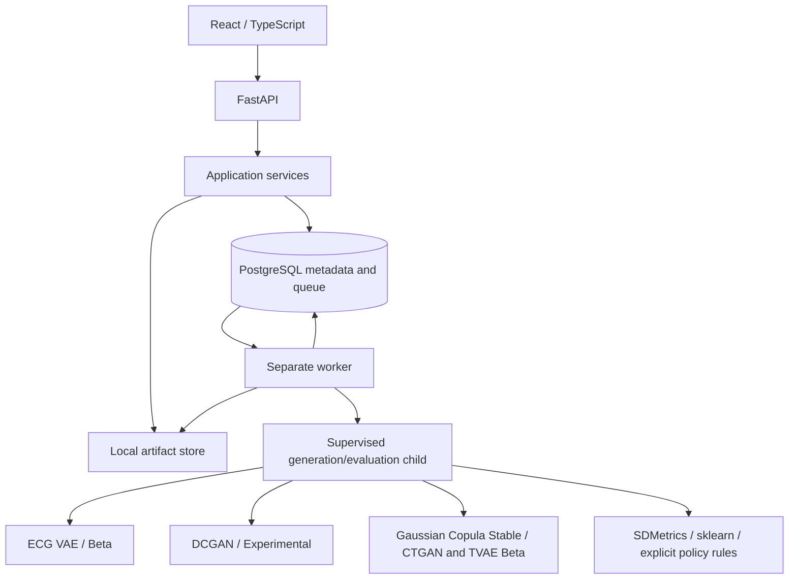
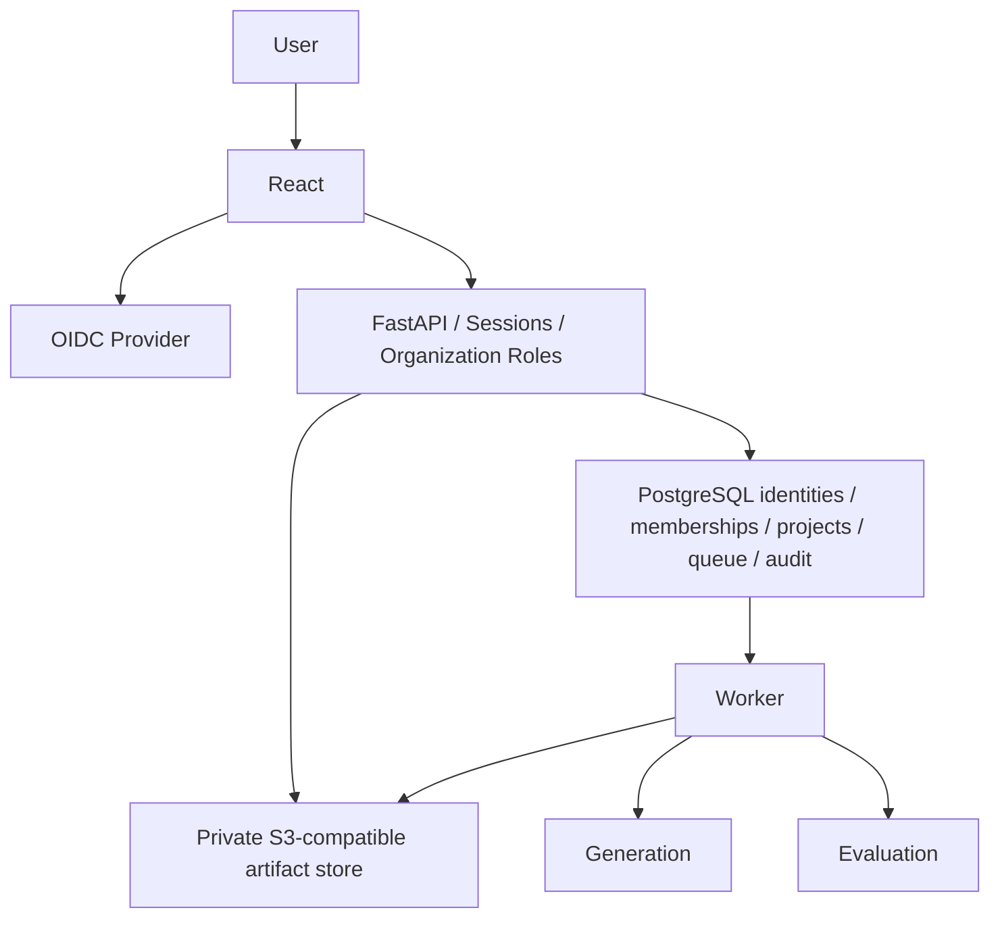

# Architecture after Phase 5

## Product boundaries

The established API/PostgreSQL/supervised-worker architecture remains. React Router supplies stable resource routes and a responsive MUI workspace shell. Lazy features separate projects, datasets, generation, evaluation and reports; local form state, typed Axios access and an abortable polling hook avoid an additional global store. Grouped workspace summaries and bounded inventories avoid per-card requests. Evaluation inventories batch execution-job reads.

Deterministic HTML reports are assembled from verified persisted evaluation evidence, never recomputed metrics. A registered `GOVERNANCE_REPORT` retains the integrity/download boundary. Migration 0004 only extends the artifact-type constraint. See [UX](UX.md), [reporting](REPORTING.md), [ADR-0013](adr/ADR-0013-governance-report-format.md) and [ADR-0014](adr/ADR-0014-frontend-information-architecture.md).

Routes validate Pydantic v2 schemas and delegate to services. Explicit repositories own SQLAlchemy queries. PostgreSQL is required; SQLite is not an application mode. ArtifactStore is a typed protocol, with local filesystem and private S3-compatible backends. ML computation happens in a worker child, never a route.

Projects, dataset registrations, jobs, artifacts and audit events survive restarts. PostgreSQL contains structure, hashes and private storage references, not source rows/binaries. Original checkpoints remain in place; newly trained full ECG checkpoints are restricted artifacts.

## Lifecycle and ownership

API lifespan initializes storage and pooled Database, then disposes pools on shutdown. Readiness checks the exact migration revision and storage; migrations are explicit. Health remains process liveness. Debug/reloader are disabled.

Workers claim rows using short FOR UPDATE SKIP LOCKED transactions and retain a session advisory ownership lock while computing. Heartbeats renew a lease; token fencing protects publication. The child exits if its parent dies or its shared monotonic deadline is not refreshed. Expired RUNNING work is recovered only after the old advisory ownership connection is gone. See [job lifecycle](JOB_LIFECYCLE.md).

No Redis, broker, S3 or distributed orchestrator is included.

## Transactions and compensation

Dataset registration commits metadata/audit after immutable UUID-keyed bytes are stored. Job submission/idempotency and claims are transactional. Success inserts all artifact rows, metadata, transition and audit in one transaction after filesystem writes.

Filesystem writes cannot join PostgreSQL transactions. On normal failure a fresh DB session checks committed references before removing bytes. If commit outcome is unknown, bytes remain and orphan reconciliation is logged. Abrupt death can leave objects/workspaces. Reconciliation considers objects older than 24 hours; stop all writers before applying deletion. No automatic retention or atomic cross-resource commit is claimed.

## Security

Public UUIDs do not expose paths. Storage rejects traversal, ambiguous keys and symlink escapes, and refuses overwrite. Downloads validate artifact record, key, hash and size. Uploads are bounded including multipart overhead. Errors omit SQL, paths and traces; logs omit source rows and contents.

OIDC authentication and organization/role authorization are implemented. Production deployment requires reviewed HTTPS/identity/storage configuration; no healthcare compliance certification is implied. Audit immutability protects ordinary SQL operations; a privileged DB administrator can bypass it. No cryptographic tamper evidence is claimed.

The worker materializes source bytes through ArtifactStore.get into its temporary attempt workspace and verifies that exact copy against the registration hash before ML. Normal workspace teardown removes it. The database pool uses five-second statement, two-second lock and fifteen-second idle-transaction timeouts. These bound ordinary database stalls; they are not a network-partition guarantee.

## Phase 3 extension

Application tabular metadata, preflight, roles/overrides, versioned train/holdout
reconstruction and a TabularSynthesizer adapter contract extend the platform.
SDV is isolated in engines.py. Computation stays in the same supervised child with
a parent-enforced timeout. Structural validation precedes fenced publication of
CSV, restricted SYNTHESIS_MODEL, STRUCTURAL_VALIDATION_REPORT and manifest.
Phase 2 locks, lease/token rules, retries and compensation are retained.
See TABULAR_SYNTHESIS.md for data flow and boundaries.

## Phase 4 evaluation

EvaluationRun and immutable ReleasePolicy are separate persistent domains. An
EVALUATION-kind GenerationJob work item reuses the same ownership/claim/lease/
fencing/recovery/supervised-child architecture; generation lists exclude it.
Evaluation HTTP requests validate inputs/configuration and enqueue, never fit
ML or run SDMetrics. The child reconstructs verified Phase 3 partitions, runs
independent quality/privacy/utility dimensions, applies explicit policy rules
and produces internal JSON reports. Parent storage compensation and fenced DB
publication commit all report artifacts, manifest and summary before success.
A deferred DB trigger also requires the complete report set at success.
See [evaluation](EVALUATION.md) and ADR-0009 through ADR-0012. No new queue broker
or enterprise infrastructure was introduced.

## Phase 6 security and operations

See [authentication](AUTHENTICATION.md), [authorization](AUTHORIZATION.md),
[tenancy](TENANCY.md), [storage](STORAGE.md), [data lifecycle](DATA_LIFECYCLE.md)
and [actual verification](PHASE_6_VERIFICATION.md). Protected API resources require
a revocable application session and selected organization membership. Mutations
require X-CSRF-Token and an allowed Origin; X-Organization-ID selects a membership.
Unauthorized foreign resources return 404; role denial returns 403; no session
returns 401. Reports remain private and HTML-escaped. Existing trained-model
download restrictions remain. Production startup rejects insecure defaults.

